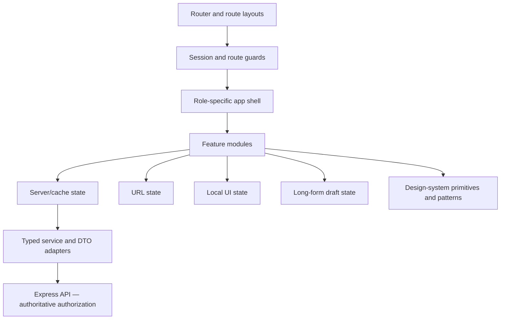

# Talvix UI Architecture

**Status:** Recommended architecture; no frontend is currently implemented.

## Status legend

| Label | Meaning |
| --- | --- |
| Implemented | Supported by the current backend or repository evidence |
| Recommended | Proposed for the future React client |
| Future | Intentionally outside initial delivery |
| Decision Required | Product or technical choice still needs approval |

## Scope

Defines the future React + TypeScript client boundary, state ownership, routing, authorization UX, and the “Frost Ledger” composition model. It does not select or install a framework, router, cache library, headless primitive library, or Tailwind.

## Architectural layers

| Layer | Responsibility | Status |
| --- | --- | --- |
| App bootstrap | Providers, error boundary, router composition | Recommended |
| App shell | Role-aware navigation, header, workspace switch context | Recommended |
| Route layouts | Public, auth, candidate, organization, admin | Recommended |
| Feature modules | Domain UI, feature hooks, feature schemas and adapters | Recommended |
| Design system | Tokens, primitives, composites, patterns | Recommended |
| Services | Typed HTTP client, DTO mapping, upload transport | Recommended |
| Backend API | Authentication and hiring domains | Implemented |
| AI/GitHub/chat/billing | Separate future feature boundaries | Future |

## State ownership

| State kind | Examples | Owner and rule |
| --- | --- | --- |
| Server/cache | Jobs, applications, permissions, notifications | Query/cache layer; invalidate by domain event or successful mutation |
| URL | Search, filters, sort, page, selected tab | Router search params; shareable and back-button safe |
| Local UI | Open menu, selected rows, disclosure state | Nearest component; do not globalize |
| Long-form draft | Job editor, assessment, scorecard, offer | Form/draft layer with explicit dirty state and recovery policy |
| Session | Identity and coarse role | Provider; never treated as authorization proof |
| Persisted preference | Density, dismissed education, locale | Server when cross-device value matters; local storage only for non-sensitive convenience |

## Route and access policy

Route guards improve usability by preventing obviously invalid navigation. They must reload current approval, active membership, company verification, and permissions where required. The API remains authoritative; a hidden control is never a security boundary. Render `403`, `401/session-expired`, suspended, pending-approval, and company-unverified states distinctly.

Top-level account roles are `candidate`, `recruiter`, and `admin` (**Implemented**). Organization Owner is a recruiter with privileged company membership, not a fourth role. Navigation items declare required capabilities and are filtered only after current membership data loads; direct URLs still resolve to an accessible denial page.

## Navigation and layout hierarchy

| Context | Primary navigation | Page layout | Auth/access behavior | Status |
| --- | --- | --- | --- | --- |
| Public | Home, Jobs, Companies, Help, Sign in | PublicLayout → TopNav → 1200px content → footer | Published public resources only | API partly Implemented / UI Recommended |
| Auth | Sign in, Register | AuthLayout → focused 480px form; optional support panel ≥1024px | Authenticated users redirect to valid workspace | API Implemented / UI Recommended |
| Candidate | Dashboard, Jobs, Applications, Assessments, Interviews, Offers, Profile | WorkspaceLayout → AppShell → route page; optional context rail | Candidate role plus resource ownership | API Implemented / UI Recommended |
| Organization | Overview, Jobs, Applications, Assessments, Interviews, Offers, Documents | WorkspaceLayout with company identity and capability-filtered nav | Approved recruiter + active membership + verified/active company + persisted permission as required | API Implemented / UI Recommended |
| Owner capability | Company, Team & permissions; Billing later | Same organization shell, additional navigation items | Privileged recruiter membership; never a fourth role | Backend model Implemented / UI Recommended |
| Admin | Overview, approval queues, oversight, notifications, analytics, health | Dense WorkspaceLayout with aggregate/context panels | Active admin; analytics aggregate and UTC bounded | API Implemented / UI Recommended |

Shared hierarchy: `App → Providers → Router → RouteGuard → Layout → AppShell → PageHeader/Toolbar → Page composition → Design-system/domain components → Overlay and system-state layers`. Dashboard hierarchy is `PageHeader → attention queue → primary task region → aggregate/supporting metrics`; cards are used only for coherent summaries, not as a uniform grid template.

## Frost Ledger composition

Navigation overlays and floating utilities may use `--surface-glass`; forms, tables, dialogs, and evidence content use opaque `--surface-1`. The reusable **EvidenceRail** connects timestamped or staged evidence with text labels, icons, and semantic state—never color alone. It supports vertical detail timelines and horizontal progress summaries, while a plain ordered-list representation remains available.

## Decisions and rationale

| Decision | Rationale |
| --- | --- |
| Feature-first modules over page-first dumping grounds | Keeps business vocabulary, queries, and privacy adapters together |
| DTO adapters between API and views | Prevents backend shapes and private fields leaking into components |
| Semantic headless primitives later | Accessibility behavior can be adopted without visual-library lock-in |
| Opaque work surfaces | Dense hiring data needs dependable contrast; glass is chrome, not content |
| Errors modeled as route and component states | Recovery belongs in the architecture, not as ad hoc toast-only handling |

## Accessibility implications

Every route has a unique title and `h1`, skip link, predictable focus placement, keyboard-complete flow, and semantic landmarks. Route changes announce meaningful context without moving focus unexpectedly. See [Accessibility](11_ACCESSIBILITY.md), [Folder Structure](12_FOLDER_STRUCTURE.md), and [Component Tree](13_COMPONENT_TREE.md).

## Decision log

| Decision | Rationale | Alternative | Status | Downstream impact |
| --- | --- | --- | --- | --- |
| One configurable workspace shell | Shared navigation and accessibility behavior | Separate role applications | Recommended | Routing, layouts, tests |
| Permission data is server/cache state | It can change independently of session token | JWT-only capability claims | Recommended UI; backend authority Implemented | Guards/navigation |
| Draft state has explicit recovery policy | Long consequential forms need safe continuity | Global state for all inputs | Recommended | Editors and session expiry |
