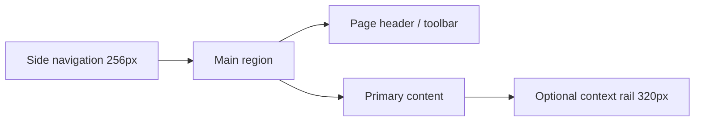

# Talvix Layout System

**Status:** Recommended; no layouts are implemented.

## Status legend

| Implemented | Recommended | Future | Decision Required |
| --- | --- | --- | --- |
| Backend domains | Layout rules below | User-resizable rails | Exact shell behavior after prototypes |

## Scope

Defines page frames, grids, work-surface hierarchy, content widths, and the Evidence Rail placement. Responsive behavior is specified in [Responsive System](10_RESPONSIVE_SYSTEM.md).

## Canonical frames

| Frame | Grid and width | Use |
| --- | --- | --- |
| Public | 12 columns; max `1200px`; 24px gutters | Job/company discovery and future marketing |
| Auth | One column; form max `480px`; supporting panel optional ≥1024px | Sign-in/register/recovery states |
| Workspace | `256px` sidebar + fluid content; max canvas `1440px` | Candidate, organization, admin |
| Detail + context | Fluid main + `320px` contextual rail | Application/interview/offer detail |
| Form | Main column max `640px`; explanatory aside optional | Editors and settings |
| Reading | Text max `720px` | Policies, instructions, long descriptions |

Desktop workspace gutters are 32px, tablet 24px, mobile 16px. Major page sections use 32px; dense internal groups use 16px. The 8px spacing foundation and 4px half-step are canonical.

## Surface hierarchy

`--surface-canvas` holds the workspace; `--surface-1` contains tables, forms, and evidence; `--surface-2` groups secondary regions. `--surface-glass` is limited to sticky navigation or floating utilities and must retain readable contrast over its actual backdrop. Do not nest multiple rounded cards merely to create hierarchy; prefer headings, separators, whitespace, and background shifts.

## App shell anatomy

The page header is not automatically sticky. Sticky toolbars use `--z-sticky:100`; dropdowns `300`; overlays `500`; modals `600`; toast `700`; tooltip `800`. A main-content skip target appears before the shell navigation in DOM order.

## Region specifications

| Region | Desktop | Compact behavior | Status |
| --- | --- | --- | --- |
| TopNav | 64px high; workspace identity, search, utilities | 56px; menu trigger, title, critical utilities | Recommended |
| SideNav | 256px fixed column at ≥1024px | Modal drawer below 1024px; focus restored to trigger | Recommended |
| Workspace grid | Sidebar + minmax(0, 1fr); inner content max 1440px | One column; 16px gutter | Recommended |
| Right context panel | 320px at ≥1280px; sticky only when content fits viewport | Moves after main content; modal drawer only for user-invoked tools | Recommended |
| Page header | Title/meta left, toolbar right; wraps without overlap | Actions wrap; primary retained, secondary in menu | Recommended |
| Dialog small/medium/large | max 480/640/960px; max height calc(100vh - 64px) | Near-full viewport with 16px edge; bottom drawer for simple selection | Recommended |
| Dialog regions | Header, scrollable body, optional persistent footer | Header/footer remain visible without obscuring focused content | Recommended |

Right-panel modes are `contextual` (related evidence), `task` (user-opened editor/drawer), and `inspector` (read-only details). Contextual content appears in document order after main content; a task drawer is modal at narrow widths; an inspector must never be the sole location of consequential information.

## Evidence Rail layout

Use vertical rails beside event content at detail widths ≥768px. On small screens, keep the rail vertical and full-width; never compress timestamps and labels into an unreadable horizontal strip. Horizontal mode is reserved for 3–7 high-level stages with a textual ordered-list alternative. Current, completed, blocked, and pending states pair line treatment with icon and label.

## Decisions and rationale

| Decision | Why |
| --- | --- |
| Recompose instead of uniformly shrinking | Preserves task priority and touch usability |
| Wide tables stay tables with controlled horizontal overflow or list alternative | Avoids destroying comparison semantics |
| Context rail moves below main content under 1024px | Protects primary task width |
| Fixed maximum content widths | Prevents long lines and sparse enterprise pages |

## Accessibility implications

Visual grid order must match DOM and focus order. Sticky elements cannot obscure focused controls; anchors receive scroll margin. At 400% zoom the UI becomes a one-column composition without two-dimensional scrolling except essential data tables. See [Spacing](09_SPACING_SYSTEM.md) and [Accessibility](11_ACCESSIBILITY.md).

## Decision log

| Decision | Rationale | Alternative | Status | Impact |
| --- | --- | --- | --- | --- |
| TopNav height is 64px/56px compact | Stable shell geometry and 44px controls | Content-sized header | Recommended | Shell and skeletons |
| Right rail begins at 1280px | Preserves useful main width | Rail at tablet width | Recommended | Detail routes |
| Dialog sizes are bounded semantic tiers | Prevents feature-specific arbitrary widths | Freeform widths | Recommended | Dialog component |
