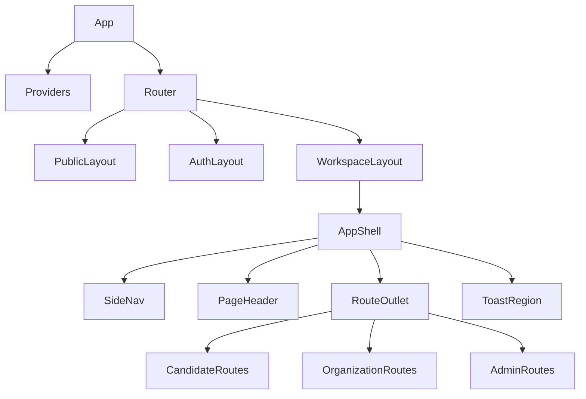

# Talvix Component Tree

**Status:** Recommended route/component composition; frontend is not implemented.

## Status legend

| Implemented | Recommended | Future | Decision Required |
| --- | --- | --- | --- |
| API domains | Trees below | Explicit future branches | Final MVP route list |

## Scope

Shows component ownership across all user contexts. Names align with [Folder Structure](12_FOLDER_STRUCTURE.md) and [Component Library](03_COMPONENT_LIBRARY.md).



## Route trees

```text
PublicLayout [Recommended]
├─ Home [Recommended]
├─ JobsList → JobDetail [API Implemented; UI Recommended]
├─ CompaniesList → CompanyDetail [API Implemented; UI Recommended]
└─ Help / Privacy / Terms / Accessibility [Recommended]

AuthLayout [Recommended]
├─ SignIn / Register [API Implemented; UI Recommended]
├─ SessionExpired [Recommended]
└─ PasswordReset / EmailVerification [Decision Required]

CandidateWorkspace [Recommended]
├─ Dashboard
├─ CandidateProfile → ProfileEditor / VisibilityControls / DocumentManager
├─ Jobs → SearchField / Filters / JobDetail / ApplyFlow
├─ Applications → ApplicationList / ApplicationDetail / EvidenceRail
├─ Assessments → AssignmentList / AttemptWorkspace / SafeResultView
├─ Interviews → InterviewList / AvailabilityEditor / CandidateProcessView
├─ Offers → OfferList / CandidateOfferView / ResponseDialog
└─ Notifications → NotificationInbox / PreferenceForm

OrganizationWorkspace [Recommended]
├─ Overview
├─ Jobs → ManagedJobs / JobEditor / ReviewStatus
├─ Applications → PipelineBoard + PipelineList / ApplicationDetail
├─ Assessments → Definitions / Questions / Assignments / Reviews
├─ Interviews → Templates / Processes / Scheduling / Scorecards
├─ Offers → Templates / Drafts / Approval / RevisionHistory
├─ Documents → EvidenceList / VerificationQueue
├─ Company → CompanyProfile / VerificationState
├─ TeamAndPermissions [owner or team.manage capability]
└─ Analytics [domain availability varies]

AdminWorkspace [Recommended]
├─ Overview / PlatformHealth
├─ RecruiterApproval / CompanyVerification / JobReview
├─ DomainOversight: Applications / Assessments / Interviews / Offers / Documents
├─ NotificationOperations
└─ AdminAnalytics → ChartFrame + accessible data table / Export
```

## Complete shell hierarchy

```text
AppShell [Recommended]
├─ SkipLink → MainContent
├─ TopNav
│  ├─ WorkspaceIdentity
│  ├─ GlobalSearch [scope varies]
│  ├─ QuickActions
│  ├─ NotificationMenu → NotificationItem[]
│  └─ AccountMenu
├─ SideNav / MobileNavDrawer
│  ├─ PrimaryNavigation
│  ├─ CapabilityFilteredOwnerNavigation
│  └─ HelpAndSupportLink
├─ MainContent
│  ├─ Breadcrumbs
│  ├─ PageHeader → Metadata + Toolbar
│  └─ RouteOutlet
├─ OptionalContextRail
└─ GlobalOverlays → Dialog / ConfirmDialog / Drawer / ToastRegion
```

Navigation filtering is **Recommended usability behavior**; current backend authorization remains **Implemented and authoritative**.

## Candidate page compositions

```text
CandidateDashboard [Recommended UI]
├─ DashboardHeader
├─ ProfileCompletion → Progress + RemainingTaskList
├─ DeadlineList → AssessmentSummary / InterviewProcessSummary / CandidateOfferSummary
├─ ActiveApplicationList → JobSummary + StatusTag
└─ NotificationPreview → NotificationItem[]

CandidateProfilePage [Recommended UI]
├─ CandidateProfileHeader
├─ VisibilityControls
├─ CandidateEvidenceSection[]: Skills / Experience / Education / Projects / Certifications
├─ DocumentManager → FileUpload / DocumentList / ReplaceDialog / DeleteConfirmDialog
└─ ProfileEditorDrawer → Form / FormSection / FormField / ErrorSummary

JobsListPage [Recommended UI]
├─ SearchField + JobFiltersDrawer
├─ AppliedFilterSummary
├─ ResultsSummary
├─ JobSummary[]
└─ Pagination / EmptyState / ErrorState

JobDetailPage [Recommended UI]
├─ JobHeader → CompanyIdentity / StatusTag / ApplicationAction
├─ JobMetadata
├─ JobDescription
├─ SkillEvidenceComparison [deterministic, if API response supports it]
└─ ApplyDialog → Form / ResumeSelection / ErrorSummary

ApplicationDetailPage [Recommended UI]
├─ JobSummary
├─ ApplicationMetadata
├─ EvidenceRail (canonical Timeline)
├─ SubmittedDocumentSummary
└─ WithdrawConfirmDialog

AssessmentAttemptPage [Recommended UI]
├─ AssessmentSummary + AssessmentTimer
├─ QuestionNavigator
├─ AssessmentQuestion
├─ AssessmentAttachment [only when immutable assignment policy permits]
└─ SubmitAssessmentDialog / SaveStatus / ErrorSummary

CandidateInterviewPage [Recommended UI]
├─ InterviewProcessSummary
├─ EvidenceRail → InterviewRound[]
├─ AvailabilityGrid
├─ InterviewScheduleCard
└─ RescheduleResponseDialog

CandidateOfferPage [Recommended UI]
├─ CandidateOfferSummary
├─ SafeTermsDescriptionList
├─ OfferRevisionRail
├─ CandidateVisibleAttachments
└─ OfferResponseDialog / NegotiationForm

CandidateSettings [Recommended / product scope partly Decision Required]
├─ AccountSettings
├─ PrivacyAndVisibility
├─ NotificationPreferences
└─ SecurityAndDataRights [partly Future]
```

## Organization and owner page compositions

```text
OrganizationOverview [Recommended UI]
├─ Metric[] / AttentionQueue
├─ ManagedJobSummary[]
├─ PipelineStageSummary
├─ UpcomingInterviewList
└─ PendingOfferApprovalList

ManagedJobsPage → JobFilters / DataTable<JobSummary> / JobEditorDrawer / SubmitForReviewDialog
ApplicationsPage → ViewToggle / PipelineBoard + PipelineList / CandidateSummary / MoveStageDialog
ApplicationReviewPage
├─ CandidateProfileHeader + CandidateEvidenceSection[]
├─ SubmittedDocumentSummary
├─ EvidenceRail
├─ RecruiterNotes [company-private]
└─ StageToolbar / AssignAssessmentDialog / ScheduleInterviewDialog

AssessmentManagement
├─ AssessmentDefinitionList
├─ AssessmentEditor → FormSection[] / QuestionEditor[] / AttachmentPolicyEditor
├─ AssignmentTable
└─ ReviewPage → AssessmentSummary / AllowedRecruiterResult / ActionToolbar

InterviewManagement
├─ InterviewProcessTable
├─ ProcessDetail → EvidenceRail<InterviewRound> / InterviewScheduleCard[]
├─ AvailabilityGrid
├─ Scorecard
└─ ScheduleOrRescheduleDialog

OfferManagement
├─ OfferTable
├─ OfferEditor → FormSection[] / InternalApprovalSection / Attachments
├─ OfferRevisionRail [internal]
└─ Approve / Send / Withdraw / ConfirmHire dialogs

CompanyPage → CompanyProfileEditor / CompanyVerificationState / LogoManager
TeamAndPermissions [Recommended; capability-gated]
├─ MemberTable
├─ PermissionMatrix
├─ AddMemberDialog
└─ RemoveOrChangePermissionConfirmDialog

OwnerCapabilities [Recommended membership extension, not a fourth role]
├─ CompanyGovernance
├─ TeamAndPermissions
└─ Billing [Future / not implemented]
```

## Admin page compositions

```text
AdminOverview [Recommended UI] → Metric[] / QueueSummary[] / PlatformHealth
ApprovalQueuePage → URLFilters / DataTable / ReviewDrawer / DecisionDialog
DocumentOversightPage → VerificationQueue / SafeMetadata / QuarantineState / DecisionDialog
NotificationOperationsPage → TemplateList / OutboxTable / EmailLogTable / RetryAction
AdminAnalyticsPage
├─ UTCDateRangeFilters / IntervalSelect
├─ AnalyticsDashboard
├─ ChartFrame[] → FunnelChart / SeriesChart + AccessibleDataTable
└─ AggregateExportDialog
```

## Shared system states

Every route composes `LoadingState`, `EmptyState`, `ErrorState`, `PermissionDenied`, `SessionExpired`, `SuspendedState`, and relevant `NotFound`. Permission loading occurs before capability-sensitive navigation. Owner UI is a capability extension of OrganizationWorkspace, never a top-level identity role.

## Future surfaces

```text
[Future — API not implemented]
├─ AIAssistancePanel
│  ├─ AIDisclosure
│  ├─ AIEvidenceList
│  └─ AICorrectionControl
├─ GitHubEvidence → ConsentDialog / ConnectionState / EvidenceList / DisconnectDialog
├─ Chat → ConversationList / Thread / Composer
├─ Billing → Plan / Usage / PaymentAdministration
├─ CalendarAndVideoProviders → Consent / Connection / Recovery
├─ OCR
└─ ESignature
```

Future AI output must identify sources, uncertainty, human control, consent, and correction paths; it cannot make autonomous hiring decisions.

## Privacy and accessibility implications

Candidate-safe assessment, interview, and offer views use distinct DTO adapters and components—not recruiter components with hidden sections. Trees preserve semantic layout and keyboard path; board views always include PipelineList. See [Accessibility](11_ACCESSIBILITY.md).

## Decision log

| Decision | Rationale | Alternative | Status | Impact |
| --- | --- | --- | --- | --- |
| TopNav and SideNav share one navigation model | Prevents mobile/desktop drift | Separate menus | Recommended | AppShell |
| Owner capabilities branch under organization | Matches persisted recruiter membership | Fourth role workspace | Implemented backend model / Recommended UI |
| Overlays are named in page composition | Makes focus recovery and consequence review explicit | Implicit feature-local modals | Recommended | Accessibility and tests |
